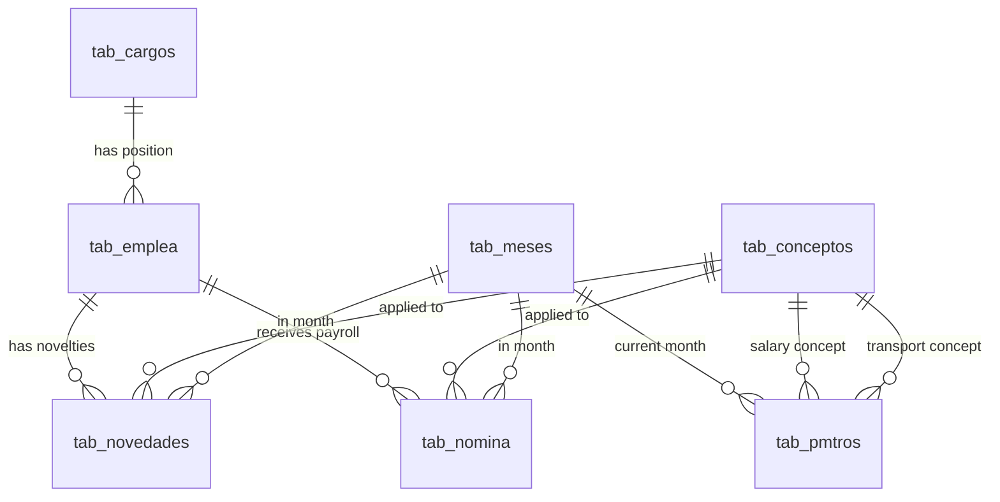

## Introduction

The NominaSoft database schema is designed to manage a complete payroll system for Colombian companies. It consists of 10 main tables that handle user authentication, employee data, payroll concepts, positions, monthly periods, and payroll processing.

## Database Tables

The schema includes the following tables:

<CardGroup cols={2}>
  <Card title="users" icon="user" href="/schema/users">
    User authentication and login management
  </Card>
  <Card title="tab_conceptos" icon="list" href="/schema/conceptos">
    Payroll concepts (earnings and deductions)
  </Card>
  <Card title="tab_cargos" icon="briefcase" href="/schema/cargos">
    Employee positions and roles
  </Card>
  <Card title="tab_meses" icon="calendar" href="/schema/meses">
    Month definitions (1-12)
  </Card>
  <Card title="tab_pmtros" icon="settings" href="/schema/pmtros">
    Company parameters and configuration
  </Card>
  <Card title="tab_emplea" icon="users" href="/schema/emplea">
    Employee personal and labor information
  </Card>
  <Card title="tab_novedades" icon="bell" href="/schema/novedades">
    Payroll novelties and adjustments
  </Card>
  <Card title="tab_nomina" icon="money-bill" href="/schema/nomina">
    Final payroll calculation results
  </Card>
  <Card title="tab_error" icon="exclamation-triangle" href="/schema/error">
    PostgreSQL error codes catalog
  </Card>
</CardGroup>

## Entity Relationships

### Core Relationships

## Table Categories

### Authentication
- **users**: User login credentials and basic profile information

### Master Data (General Data)
- **tab_conceptos**: Payroll concepts definitions
- **tab_cargos**: Employee positions/roles
- **tab_meses**: Month catalog (enero to diciembre)
- **tab_pmtros**: Company-wide payroll parameters

### Employee Data
- **tab_emplea**: Complete employee information (personal, contact, labor)

### Payroll Processing
- **tab_novedades**: Input - changes and adjustments to payroll
- **tab_nomina**: Output - final calculated payroll values

### Error Handling
- **tab_error**: PostgreSQL SQLSTATE error codes with descriptions

## Key Features

### Payment Periods
The system supports two payment periods:
- **Q** (Quincenal): Bi-weekly payments
- **M** (Mensual): Monthly payments

### Payroll Concepts
Concepts are categorized as:
- **Devengados** (Earnings): `ind_operacion = TRUE`
- **Deducciones** (Deductions): `ind_operacion = FALSE`
- **Obligatorios** (Mandatory): Required by Colombian law
- **No Obligatorios** (Optional): Company-specific benefits

### Colombian Compliance
The schema includes fields for Colombian labor law requirements:
- **SMLV**: Salario Mínimo Legal Vigente (Legal Minimum Wage)
- **Auxilio de Transporte**: Transportation allowance
- **EPS**: Health insurance contribution (4%)
- **AFP**: Pension fund contribution (4%)

## Data Integrity

### Foreign Key Constraints
All tables use `ON DELETE CASCADE ON UPDATE CASCADE` to maintain referential integrity.

### Check Constraints
Extensive validation rules ensure:
- Proper date ranges (months 1-12)
- Valid salary amounts (>= 0)
- Name length requirements
- Data type consistency
- Colombian-specific validations (estrato 1-6, marital status codes)

## Schema Creator

**Author**: Camilo Suarez  
**Date**: March 6, 2025

## Next Steps

Explore individual table documentation to understand column definitions, data types, constraints, and sample data:

- [users Table](/schema/users)
- [tab_conceptos Table](/schema/conceptos)
- [tab_cargos Table](/schema/cargos)
- [tab_meses Table](/schema/meses)
- [tab_pmtros Table](/schema/pmtros)
- [tab_emplea Table](/schema/emplea)
- [tab_novedades Table](/schema/novedades)
- [tab_nomina Table](/schema/nomina)
- [tab_error Table](/schema/error)